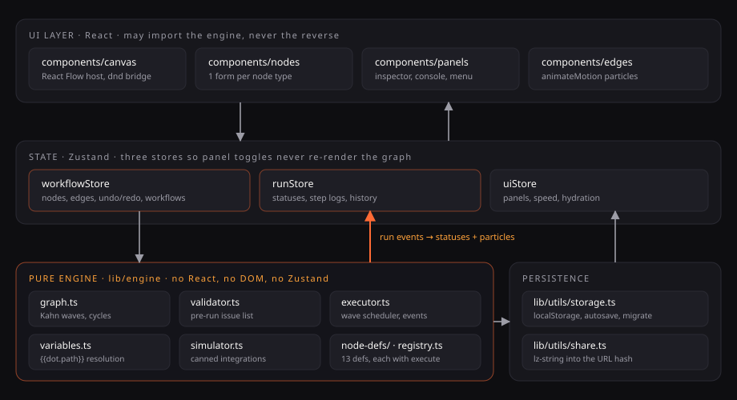

# FlowForge

A visual workflow builder — a miniature Make.com / n8n that runs entirely in your browser.
Drag nodes onto an infinite canvas, wire them together, press **Run**, and watch the data
travel: edges light up with particles, nodes pulse while they execute, and every payload
lands in a console you can expand to exact JSON.

Every integration is **simulated**. There are no API keys, no backend, and no network calls
to third parties. Workflows persist to `localStorage` and share as a link that encodes the
whole graph.

---

## Screenshots

> **Not in the repo yet — and this is a deliberate omission, not an oversight.**
>
> This project was built in a sandboxed environment with no browser binary available
> (Chromium download is network-blocked, as are `ui.shadcn.com` and Google Fonts), so there
> was no way to capture real screenshots. Rather than commit AI-generated mockups of an app
> that already exists, the capture script ships instead:
>
> ```bash
> npm i -D playwright && npx playwright install chromium
> npm run docs:screenshots      # writes docs/screenshots/*.png against a production build
> ```
>
> It drives a real Chromium against `npm run build && npm start`, loads the Lead capture
> template, runs it, and captures the five views below. Run it once on a machine with a
> browser and the images land in the right place.

Planned captures (paths the script writes to):

| File | Shows |
| --- | --- |
| `docs/screenshots/01-landing.png` | Hero with the looping animated demo |
| `docs/screenshots/02-builder-empty.png` | Empty canvas, palette, inspector |
| `docs/screenshots/03-running.png` | Mid-run: particles on edges, nodes pulsing |
| `docs/screenshots/04-console.png` | Run console expanded to a step's JSON input/output |
| `docs/screenshots/05-templates.png` | The template gallery |

---

## What it does

**Canvas** — infinite pan/zoom, dotted grid, minimap, drag-from-palette *and* keyboard-add,
connect via handles, multi-select, Delete to remove, ⌘/Ctrl+D to duplicate, ⌘/Ctrl+Z and
⌘/Ctrl+⇧Z to undo/redo, and an auto-layout button that arranges the graph left to right.

**13 node types**, each with its own icon, accent colour and config form:

| Group | Nodes |
| --- | --- |
| Triggers *(no input)* | Manual (editable sample JSON) · Webhook (fake URL + sample payload) · Schedule (cron, fires once per run) |
| Actions *(in → out)* | AI Prompt (`{{variables}}`, canned response) · HTTP Request (method/URL/headers → mock JSON) · Transform (key/value map or merge) · Filter (equals / notEquals / contains / gt / lt, two labelled `true`/`false` handles) · Delay · Text Formatter |
| Outputs *(no output)* | Email · Slack · Google Sheets row · Log Output |

**Execution** — topological wave scheduling, branching and merging, six node statuses
(`idle` / `queued` / `running` / `success` / `error` / `skipped`), simulated latency of
300–1200 ms per node, a per-node *Simulate failure* toggle, and 0.5× / 1× / 2× speed control.
Pre-run validation catches cycles, disconnected nodes, missing triggers and missing required
config, and reports each issue **on the node that caused it**.

**Templates** — four working flows with realistic sample data: Lead capture, Content
repurposing, Invoice reminder, Support triage.

**Save & share** — autosave, multiple named workflows, JSON import/export, and *Copy share
link* which lz-string-compresses the graph into a `#flow=` URL hash.

---

## Architecture



The single most important rule in this codebase:

> **Nothing under `lib/engine/` may import React, `@xyflow/react`, or Zustand.**

The engine takes plain data and returns plain data plus an event stream. That one constraint
is why it is unit-testable in a plain Node environment with no DOM, no fake timers and no
component mounting — and it is verifiable rather than aspirational:

```bash
grep -rnE '^import .*(react|@xyflow|zustand)' lib/engine/   # prints nothing
```

The engine's entire import surface is its own files plus `@/config/constants` and `@/types/*` —
no UI framework, no store, no DOM.

### Execution model

1. `graph.ts` runs Kahn's algorithm over the graph to produce **waves** — topological
   generations. If any node is left over, the graph has a cycle and validation fails before a
   single node runs.
2. `executor.ts` advances wave by wave. A node runs when **every** incoming edge has settled;
   it **skips** when all settled without carrying data. An errored node delivers nothing
   downstream, so its successors skip rather than receive a partial payload.
3. `variables.ts` resolves `{{dot.path}}` with a precedence chain: bare dot-notation →
   `$payload.` → `$node.<id>.` → `$run.`. Unresolved tokens render empty *and* are collected,
   so a typo is visible instead of silently blank.
4. Everything time- or random-dependent is injected as `sleep` / `now` / `random` on
   `StepContext`. Tests pass a fake clock that advances on `sleep`, so an entire run —
   latency included — completes **synchronously**.

### State

Three Zustand stores, split so that toggling a panel never re-renders the graph:
`workflowStore` (nodes, edges, undo/redo, named workflows), `runStore` (statuses, step logs,
history), `uiStore` (panels, speed, hydration). Undo snapshots exclude the viewport — panning
is not an edit — and coalesce a whole drag into one step.

---

## Project structure

```
app/            landing page + /builder
components/     canvas · nodes · edges · panels · layout · ui
lib/
  engine/       PURE — graph, validator, variables, executor, simulator, node-defs
  templates/    the 4 built-in flows
  layout.ts     auto-layout (columns come from analyzeGraph waves)
  utils/        share.ts (lz-string), storage.ts (localStorage)
store/          workflowStore · runStore · uiStore
hooks/          run, validation, persistence, shortcuts, media query
types/          discriminated-union node configs, edges, workflows, run results
```

Full annotated tree in [`PROJECT_NOTES.md`](PROJECT_NOTES.md).

---

## Getting started

```bash
npm install
npm run dev        # http://localhost:3000
```

| Script | What it does |
| --- | --- |
| `npm run dev` | Dev server |
| `npm run build` | Production build (fully static — no server runtime needed) |
| `npm start` | Serve the production build |
| `npm test` | Vitest, single run |
| `npm run test:watch` | Vitest in watch mode |
| `npm run lint` | ESLint |
| `npm run docs:screenshots` | Capture the README screenshots (needs Playwright, see above) |

Both routes prerender as static content, so deployment is a plain `vercel` with no
configuration — see [`vercel.json`](vercel.json).

---

## Testing

**184 tests across 10 files.** They cover logic, not pixels — which is exactly what the pure
engine boundary buys you.

| File | Tests | Covers |
| --- | --- | --- |
| `lib/engine/__tests__/executor.test.ts` | 31 | wave scheduling, branching, merge semantics, skip propagation, failure simulation |
| `lib/engine/__tests__/registry.test.ts` | 33 | node construction, handle rules, config defaults |
| `lib/engine/__tests__/variables.test.ts` | 27 | `{{dot.path}}` resolution and precedence |
| `store/__tests__/workflow-store-history.test.ts` | 25 | undo/redo, duplicate, multi-workflow, run history |
| `lib/__tests__/templates.test.ts` | 15 | all 4 templates validate, are acyclic, and run to completion |
| `store/__tests__/workflow-store.test.ts` | 14 | connection rules, delete, rename |
| `lib/engine/__tests__/validator.test.ts` | 11 | cycles, missing triggers, unreachable nodes |
| `lib/utils/__tests__/share.test.ts` | 10 | lz-string round-trip, corruption and schema rejection |
| `lib/engine/__tests__/graph.test.ts` | 10 | topological waves, reachability |
| `lib/__tests__/layout.test.ts` | 8 | column ordering, determinism, cyclic-graph safety |

---

## Design system

One accent — **ember orange** — never blue or purple. `#FF6B35 → #FFA23A` in dark mode
(the default), `#C2410C → #B45309` in light mode.

Those light values are not arbitrary. `.text-gradient-ember` clips the gradient *as text* and
the primary button paints a label over it, so both stops are load-bearing foreground. The
original light accents measured **3.68:1** and **2.63:1** against the background — a genuine
WCAG AA failure — so they were darkened until **all twelve foreground/background pairs clear
4.5:1 in both themes**.

Accessibility beyond contrast: a global `:focus-visible` ring, palette items that are real
`<button>`s (drag is an enhancement, not the only path), two labelled `true`/`false` handles
on the filter node rather than colour alone, and `prefers-reduced-motion` handling on the
shake animation and the landing demo.

### Responsive

Two tiers, split at 1024px:

- **Wide** — palette | canvas | inspector, all docked, each collapsing to a thin rail so the
  canvas can take the full width. At 1024px a permanently docked palette and inspector left
  only ~448px of canvas, which is why they collapse rather than merely hide.
- **Compact** — full-bleed canvas with a bottom app bar. Nodes, Inspector and Console each
  open as a bottom sheet over the canvas, so **the builder is fully editable on a phone**,
  not a read-only preview. Touch pans the canvas, two fingers pinch-zoom.

They share one implementation: `RunPanelContent` and `InspectorContent` are the same
components in both shells, so the docked console and the sheet console cannot drift apart.

---

## Tech stack

Next.js 16 (App Router) · TypeScript strict · Tailwind CSS v4 · `@xyflow/react` 12 · Zustand 5
· Framer Motion 14 · `lucide-react` · `lz-string` · Vitest 5 · hand-written shadcn-style
primitives in `components/ui`.

---

## What I'd build next

1. **Subflows.** Collapse a selection into a single node with a real signature. The engine
   already works on plain graphs, so this is mostly a graph-splicing step plus a nested canvas
   — but it needs a decision about variable scoping across the boundary.
2. **Real integrations behind the same interface.** `NodeTypeDef.execute` already returns a
   discriminated result, so a real HTTP node is a drop-in for `simulator.ts`. The interesting
   work is credential handling and retry/backoff, which the current status model doesn't
   express.
3. **A test runner for workflows.** Given a set of sample payloads, assert the final output —
   essentially a fixture system. The engine's synchronous fake-clock execution makes this
   cheap.
4. **Collaborative editing.** The undo stack is a plain snapshot array, which would need to
   become an operation log (or CRDT) before it survives concurrent edits.
5. **Touch-first editing refinements.** The mobile sheets work, but multi-select relies on
   `Shift`/`Meta` with no touch equivalent, sheets are a fixed 60dvh rather than
   drag-resizable, and the compact tier has no minimap.
6. **Edge-case handling in the executor.** Per-node retry, timeout, and an explicit
   error-handling branch — the thing n8n and Make actually get used for.

## Known limitations

- Pointer interactions (drag-and-drop, handle-to-handle connection, the dropdown and dialog
  menus) are not covered by tests. The logic underneath them is; the interaction itself is
  verified by hand.
- No headless-browser run in CI, so console-error freedom is asserted from served markup.
- `npm audit` reports 5 high findings, all one dev-only chain
  (`braces` → `micromatch` → `fast-glob` → `@next/eslint-plugin-next`). The only offered fix
  downgrades `eslint-config-next` to 14.x, which would break Next 16 linting. Not shipped to
  production; deliberately left.
- Share links have a 2000-character soft limit, after which the UI warns that some apps may
  truncate the URL.

## Licence

MIT.
